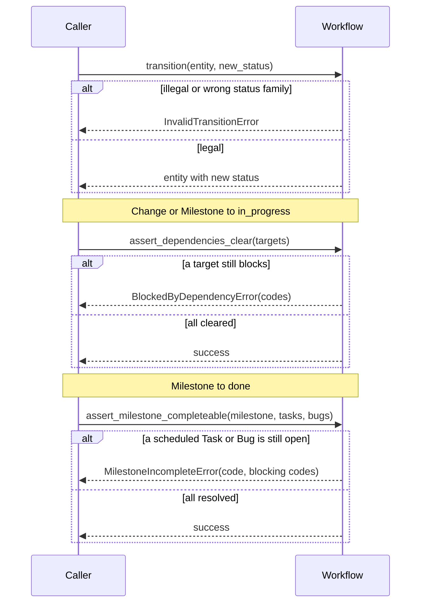
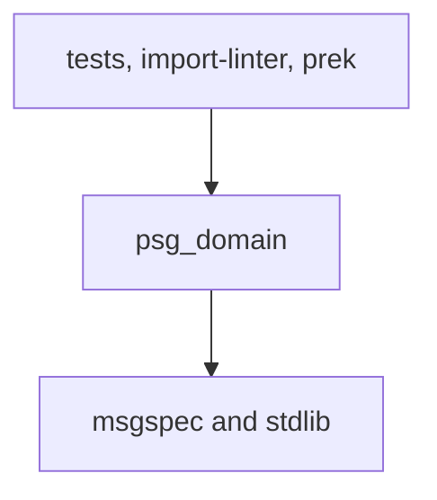

# Entity types and status transitions

This document records the architecture of the first `psg-domain` change. The change adds typed entities and the Workflow module. Domain rules live in `psg-domain`. Tests call domain functions directly. Persistence, the HTTP API, and the CLI belong to later changes. The project seed in `docs/anneal/SEED.md` places those rules in `psg-domain`.

## Components

The change adds the components below.

| Component | Responsibility |
| --- | --- |
| `psg-domain` package | uv workspace member. Import name `psg_domain`. Depends on msgspec only. |
| Entity structs | msgspec `Struct` values for Project, Milestone, Change, Fact, Task, Validation, Bug, Idea, DocumentRef, and ValidationScenario. Each entity has a `workspace_id` field. Fact codes use `-F{N}`. Task codes use `-T{N}`. |
| Workflow module | Owns the transition tables and `transition`. Owns the dependency-blocked guard and the milestone-completion guard. Both guards take related entities. |
| Domain errors | `InvalidTransitionError`, `BlockedByDependencyError`, and `MilestoneIncompleteError`. |
| Unit tests | Live in `packages/psg-domain/tests/`. They cover legal transitions, illegal transitions, and both guards. |
| import-linter and prek | `psg_domain` imports the standard library and msgspec. The commented prek import-linter hook is enabled. |

The root `src/psg` stub stays. Persistence and the API become later callers of these functions. Those callers load related rows and then call Workflow.

## Interaction

Workflow exposes three functions. The caller composes them.



`transition` checks the transition table only.

A call with the same status returns the entity unchanged.

When a Change or a Milestone moves to `in_progress`, the caller runs `assert_dependencies_clear`. Then the caller runs `transition`.

When a Milestone moves to `done`, the caller runs `assert_milestone_completeable`. Then the caller runs `transition`.

A dependency target is **cleared** when its status satisfies the rule for that target's status enum family. The guard dispatches on `type(target.status)`, not string comparison across enums. `in_progress` on a Project means the prerequisite is real enough to build on — not that the project is "done."

| Status enum | Cleared values | Still blocking |
| --- | --- | --- |
| `WorkflowStatus` | `done` | `pending`, `in_progress` |
| `ProjectStatus` | `in_progress`, `obsolete` | `pending` |
| `TriageStatus` | `done`, `wontfix`, `converted` | `open` |
| `LifecycleStatus` | `active`, `superseded` | — |

Any `StatusOwning` kind may appear as a dependency target. The guard checks status only. Which edges are valid is a persistence and API concern.

Blocked is not a status. A later `context` or `view` projection may list `blocked_by` codes from targets that still block.

Milestone completion inspects scheduled Tasks and scheduled Bugs only. The caller passes pre-filtered lists; guards do not read `milestone_id`. A Task or a Bug is resolved when its status is `done`, `wontfix`, or `converted` — the same triage set the dependency guard uses.

Every call in this change is in-process.

## Domain functions

These functions are the edge of the change. HTTP is a later contract.

```python
StatusValue = WorkflowStatus | ProjectStatus | LifecycleStatus | TriageStatus

def transition[E: StatusOwning](entity: E, new_status: StatusValue) -> E:
	...

def assert_dependencies_clear(targets: Sequence[StatusOwning]) -> None:
	...

def assert_milestone_completeable(
	milestone: Milestone,
	scheduled_tasks: Sequence[Task],
	scheduled_bugs: Sequence[Bug],
) -> None:
	...
```

`StatusOwning` is every entity that has a `.status` field. `new_status` must be the same enum family as `entity.status`. A family mismatch raises `InvalidTransitionError` with `allowed=[]` before the transition table is consulted. An illegal step within the same family populates `allowed` with the legal next statuses.

Errors carry the fields a caller needs to report. `blocking_codes` in both guard errors are sorted alphabetically.

| Error | Fields |
| --- | --- |
| `InvalidTransitionError` | current status, requested status, allowed list (`[]` on family mismatch) |
| `BlockedByDependencyError` | `blocking_codes` (sorted) |
| `MilestoneIncompleteError` | `milestone_code`, `blocking_codes` (sorted) |

`@pytest.mark.unit` tests in `packages/psg-domain/tests` verify this edge. The tests construct structs and call Workflow functions. Assertions include legal moves on every table, skipped steps, moves away from a terminal status, and family mismatch with `allowed=[]`. Guard tests cover per-family cleared sets (at least Project, Change, and Task), empty dependency lists, blocking targets, thin Milestone `in_progress` coverage, and milestone completion for open and resolved Tasks or Bugs.

## Data model

Entity types are msgspec `Struct` types with `kw_only=True`. Each entity has an integer `id` with default `0`, and an integer `workspace_id`. Parent links are integer ids in `parent_id`, `project_id`, and `change_id`. Codes are the agent-facing names.

Status is four enums, one per job. `transition` is one function. It picks the table from the enum on `entity.status`.

| Enum | Job | Values | Kinds |
| --- | --- | --- | --- |
| `WorkflowStatus` | work progress | `pending`, `in_progress`, `done` | Change, Milestone |
| `ProjectStatus` | project progress | `pending`, `in_progress`, `obsolete` | Project |
| `LifecycleStatus` | whether a record is still current | `active`, `superseded` | Fact, Validation |
| `TriageStatus` | how an open item was closed | `open`, `done`, `wontfix`, `converted` | Task, Bug, Idea |

DocumentRef has no status.

| Kind | Status enum | Code pattern | Fields in this change |
| --- | --- | --- | --- |
| Project | `ProjectStatus` | `^[A-Za-z0-9_-]+$` | `id`, `workspace_id`, `code`, `status` |
| Milestone | `WorkflowStatus` | `-MS{N}` | `id`, `workspace_id`, `code`, `status`. `sequence` is omitted. |
| Change | `WorkflowStatus` | `-C{N}` | `id`, `workspace_id`, `code`, `kind` (`ChangeKind`, required), `status`. `sequence` is omitted. |
| Fact | `LifecycleStatus` | `-F{N}` | `id`, `workspace_id`, `code`, `status`, `superseded_by` |
| Task | `TriageStatus` | `-T{N}` | `id`, `workspace_id`, `code`, `status`, `change_id`, `milestone_id`, `converted_to_code` |
| Validation | `LifecycleStatus` | `-V{N}` | `id`, `workspace_id`, `code`, `status`, `scenarios`, `coverage`, `change_id`, `superseded_by` |
| Bug | `TriageStatus` | `-B{N}` | `id`, `workspace_id`, `code`, `status`, `severity` (`BugSeverity`), `change_id`, `milestone_id`, `converted_to_code` |
| Idea | `TriageStatus` | `-I{N}` | `id`, `workspace_id`, `code`, `status`, `converted_to_code` |
| DocumentRef | none | none | `doc_type`, `path`, optional `project_id`, optional `change_id`. No `workspace_id` — tenancy via the owner row. |

`ChangeKind`: `new_feature`, `feature_update`, `cross_cutting`, `refactor`. `BugSeverity`: `low`, `medium`, `high`, `critical`. Narrative fields (`title`, `goal`, `body`, and so on) wait for the persistence change.

Transition tables live in the Workflow module. Entity structs hold status fields only.

| Enum | Allowed moves |
| --- | --- |
| `WorkflowStatus` | `pending` to `in_progress` to `done`. `done` is terminal. |
| `ProjectStatus` | `pending` to `in_progress` to `obsolete`. `pending` may move to `obsolete`. |
| `LifecycleStatus` | `active` to `superseded`. `superseded` is terminal. |
| `TriageStatus` | `open` to `done`, `wontfix`, or `converted`. Terminal statuses stay terminal. |

Guards take entity lists. DocumentRef is one struct.

Promotion and absorption are different links. They share no extra status.

| Link | Meaning | Status | Default kinds |
| --- | --- | --- | --- |
| `converted_to_code` | This row became that entity. 1:1. Target is a Change or a Project. | `converted` | Idea. Task and Bug only when the leftover grows into a Change or a Project. |
| `change_id` | This row is covered by that Change. N:1. The item keeps its identity. | stays `open` until `done` or `wontfix` | Task, Bug, Validation |

There is no `solved_by` status. An open Task or Bug with a `change_id` is still open. A later `context` or `view` may group those rows under the Change. The agent that closes the Change closes the linked items, or housekeep flags drift. Convert commands belong to a later TriageEntity change. This change only puts the fields on the structs and allows `converted` as a triage move.

## Dependency direction

Source dependencies point at `psg_domain`. `psg_domain` imports the standard library and msgspec.



Later packages depend on `psg_domain` in this direction: `psg-cli` to `psg-api` to `psg_domain`, and `psg-persistence` to `psg_domain`. Those packages belong to later changes.

import-linter runs with `include_external_packages = true`. A forbidden contract lists `psg_domain` as the source. Forbidden modules are `psg`, `psg_persistence`, `psg_api`, `psg_cli`, FastAPI, Typer, Pydantic, httpx, SQLAlchemy, and aiosqlite. The import-linter graph includes those third-party packages. Stdlib modules such as `sqlite3` stay outside that graph. Guard signatures take entities.

Repo tooling for this package is as follows.

- pytest `testpaths` includes `packages/psg-domain/tests`.
- ruff `known-first-party` includes `psg_domain`.
- The prek import-linter hook is enabled.
- `psg-domain` depends on `msgspec>=0.18`.
- `psg-domain` is a workspace member. The root project has no `psg-domain` dependency.

## Decisions

| Decision | Reason | Tradeoff |
| --- | --- | --- |
| Four status enums, one `transition` function. | Each family is a different job and a different vocabulary. Sharing `done` across Change and Bug would make one word mean two machines. | More enum types. Illegal mixes fail at the type, not at runtime. |
| `LifecycleStatus` is `active` to `superseded` only. | `superseded` already means replaced. A Fact or Validation with no successor is deleted. | Project still uses `obsolete` so a container can retire without cascade delete. |
| `LifecycleStatus` never blocks dependencies. | An `active` Fact or Validation is current and usable. `superseded` is historical, not a gate. | Dependency guard always clears this family. |
| `ProjectStatus` shares workflow vocabulary. | `pending` and `in_progress` match Change and Milestone. Projects use `obsolete` instead of `done`. | No `live` term to explain separately from work progress. |
| Task stays on `TriageStatus`. | Tasks close from the backlog. `WorkflowStatus` forbids skip from `pending` to `done`. | Bug and Idea stay on the same triage enum. |
| `wontfix` stays. | A refused Bug is a decision. Delete is amnesia. The next agent files the same item. | More terminal values on triage. |
| Blocked is a read projection, not a status. | Blocked is a fact about other entities. A stored status would drift when a dependency completes. | `context` and `view` later add `blocked_by`. This change only has the guard. |
| Promotion is `converted` plus `converted_to_code`. Absorption is `change_id`. | Idea becomes a Change or a Project. Task and Bug are usually part of a Change and keep their identity. | Rare 1:1 convert remains allowed on Task and Bug. No `solved_by` status. |
| Workflow is a module of pure functions. Transition tables live in that module. | The seed says Workflow owns the state machine. | Callers compose `transition` with the guards. Write orchestration is that composer. |
| Guards take related entities. | Persistence stays outside domain. | Persistence loads targets, tasks, and bugs before it calls a guard. |
| Each entity has an integer `id` and an integer `workspace_id`. | Integer ids stay stable across recode. The seed puts workspace tenancy on rows from the start. | Entities carry persistence ids. A codes-only identity changes on recode. |
| `transition` returns a new struct through `msgspec.structs.replace`. | Workflow is a function. Structs remain msgspec `Struct` instances. | Callers use the returned entity. |
| One `DocumentRef` has optional `project_id` and optional `change_id`. | The seed uses one ref type for projects and changes. | Write orchestration enforces that exactly one owner is set. |
| Per-family dependency-cleared sets. | Each status enum means something different. `in_progress` on a Project clears the dependency; it does not mean work is complete. | Dispatch on `type(status)`, not a flat string set. |
| Shared triage resolved constant. | Milestone guard and dependency guard use the same `done` / `wontfix` / `converted` set for `TriageStatus`. | One private constant in `workflow.py`. |
| `milestone_id` on Task and Bug. | Persistence-ready field for scheduled items. | Guards take pre-filtered lists and ignore `milestone_id` in this change. |
| Identity-slice structs. | DOM-C1 needs codes, status, and link fields for guards and errors. | Narrative fields come with persistence. |
| The dependency guard always applies its rule. | This change has no caller that skips the rule. | A later API that skips the rule omits the guard call. |
| `blocking_codes` sorted alphabetically. | Stable test assertions and CLI output. | Caller input order is not preserved. |
| `row_version` waits for persistence. | This change needs entities, Workflow, and tests. | The persistence change adds `row_version` on save. |

## Scope

This change includes `packages/psg-domain`, the entity structs, Workflow, the three errors, unit tests, and import-linter plus prek wiring.

Later changes include ContextAssembly, ViewProjection, TriageEntity writes, GraphRepository, the HTTP API, the CLI, `row_version` with `If-Match`, auth, code allocation, recode, delete cascade, `blocked_by` on reads, and convert commands.
