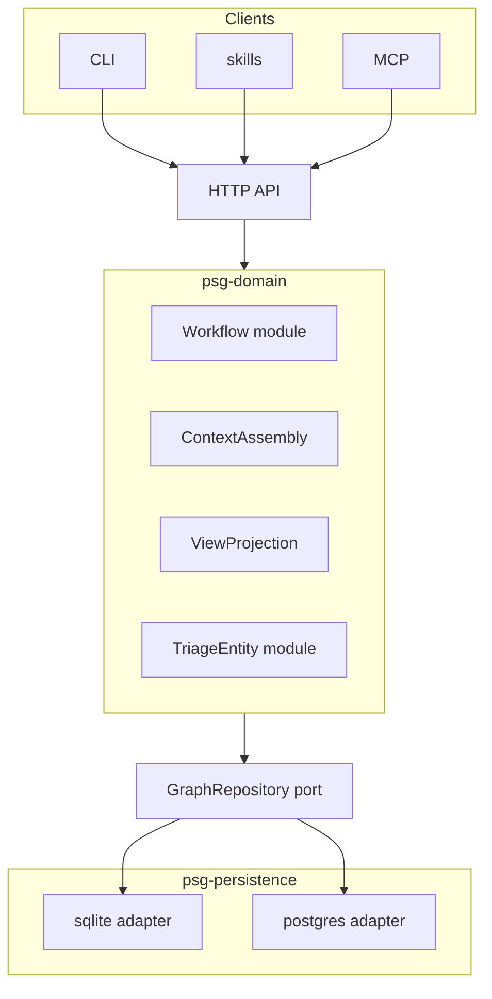

# Product State Graph — system architecture

Product scope, tiers, and the rebuild plan are in [Project seed](SEED.md).

## Architecture

One domain. One HTTP API. Two database adapters. Every client uses the API.

```
CLI / skills / MCP  →  HTTP API  →  domain modules  →  GraphRepository port  →  sqlite adapter
                                                                              └──→  postgres adapter
```

The HTTP API is the contract. The CLI, skills, and MCP are thin clients. They do not open the database. Domain logic lives in the domain layer. API handlers validate, call domain functions, and serialize responses. Handlers stay thin — all business rules live in `psg-domain`, not in handlers or persistence.

Locked: API-only client path, FastAPI, msgspec domain + Pydantic wire models, four workspace packages, thin API handlers with all business rules in domain, GraphRepository persistence port, domain-owned state machine.



### Domain modules

`psg-domain` is not a flat bag of structs. Group behaviour into deep modules — small interfaces, most logic inside.

**Workflow module** — owns the state machine end to end: transition tables, `transition(entity, new_status)`, dependency guards, milestone completion guards, and domain errors. The donor splits this across `domain/models.py` (tables only), `storage/guards.py`, `storage/transitions.py`, `commands/entities.py`, and `cli/_parse_fields.py`. Consolidate during the port. Persistence stores rows; it does not decide whether a transition is legal.

**TriageEntity module** — one module for Bug, Idea, and Task lifecycle: close, convert, link to change, resolve owner. The donor copies the same pattern three times (`commands/bug.py`, `commands/followup.py`, `commands/idea.py`). Parameterize by entity kind instead of porting three shallow modules.

**ContextAssembly** — builds the agent context bundle (active change, milestones, open triage, linked doc refs, recent history). The donor's `queries/context/` is deep but sits beside write orchestration with no package home. Lift it into domain. The API serializes the result to Pydantic DTOs; the CLI renders DTOs to text on the client side.

**ViewProjection** — overview, detail, filtered lists, dependency subgraphs, topological change ordering. Same split as context: domain assembles structured projections; API returns DTOs; CLI renderers stay in `psg-cli`.

Write orchestration (create, update, delete, move, recode) also lives in domain functions that call the persistence port. The donor's `commands/` package becomes domain write functions, not a parallel application layer beside queries.

### Persistence port

Do not thread `sqlite3.Connection` (or any driver handle) through domain or API code. The donor passes a raw connection through ~50 call sites across `storage/`, `db/`, `commands/`, and `queries/` — that implicit interface blocks the API from sitting in the middle.

Define a **GraphRepository** port in `psg-persistence` before building HTTP handlers:

- Entity CRUD with workspace scoping
- Graph operations (deps, traceability links, subtree)
- Search (keyword FTS behind the port; adapter-specific inside)
- Mutation log append and query
- Optimistic save with `expected_version` (see Concurrent agents)

Merge the donor's split persistence (`storage/` generic CRUD + `db/` sqlite-specific graph, codes, FTS, migrations) into one package behind this port. Extend the existing `RetrievalStore` protocol pattern to cover the full repository, not just search.

Two adapters justify the seam: sqlite and postgres. In-memory fake for domain and API tests. SQL stays inside adapters — nowhere else.

Porting commands/queries onto a raw connection and adding API later recreates shallow pass-through handlers.

### Server and workspace

PSG runs as a server process (`psg serve` or a hosted deployment). You pick the database backend at deploy time:

| Backend | Typical use |
| --- | --- |
| **sqlite** | Single developer, low ops, one machine |
| **postgres** | Company deployment, many parallel agents, hosted SaaS |

Same schema and API on both backends. Adapter-specific code stays in persistence (full-text search, migrations, locking).

One **workspace** is a tenant boundary — a personal workspace or an org workspace. All projects for that tenant live in one database. `workspace_id` scopes every row. Nested projects stay rows inside the workspace; they are not separate databases.

This is a bigger shift than renaming Knowledge → Fact. The donor hosts one sqlite file per project under `~/.anneal/projects/{code}/`. PSG hosts one workspace database with many root projects. `psg init`, backup, migrate, and restore must target the workspace, not a per-repo database file.

**Workspace module** — a first-class concern in `psg-api` (auth + scoping), not an afterthought column:

- Bearer token validation and workspace membership lookup
- Row scoping: every repository call carries `workspace_id`
- Project registration (`psg init` registers a root project on the server)
- Audit: mutation log records `who` on each change

Auth is membership on the workspace, not entity ACLs. Even a solo developer uses a workspace and a token so the model does not fork when a second user joins.

### Repo linkage

A code repo stores a pointer file (for example `.psg/config.json`): server URL, workspace, project code, auth. `psg init` registers a project on the server and writes that pointer.

### Concurrent agents

Multiple agents hit the same API concurrently. The server is the write choke point: transactions, dependency guards, and optimistic concurrency apply in one place. Clients retry or surface errors. Do not give agents a second path that opens sqlite or postgres directly.

**Optimistic concurrency** — wire `row_version` end to end. The donor auto-increments `row_version` via sqlite triggers but never checks it on update — parallel agents can silently overwrite each other.

- Every entity row carries `row_version`
- Domain `save(entity, expected_version)` checks before write; persistence adapter enforces in SQL
- API `PATCH` accepts `If-Match: <version>` (or equivalent body field); mismatch returns **409 Conflict**
- Document 409 in OpenAPI so agents know to re-read and retry
- Dependency guards run in the Workflow module at the same choke point, not scattered in storage SQL

## Tech stack

| Area | Choice |
| --- | --- |
| Language | Python 3.14+ |
| Package manager | uv workspace |
| API | FastAPI |
| API wire models | Pydantic (request/response DTOs, OpenAPI) |
| Domain models | msgspec `Struct` (entities, invariants, domain logic) |
| CLI | Typer (`psg` command, HTTP API client) |
| sqlite | WAL mode |
| postgres | same schema, deploy-time adapter swap |
| Packaging | uv workspace packages in one repo (not published to PyPI) |

### Workspace packages

One repository. Four workspace packages. `import-linter` enforces dependency direction.

| Package | Holds | May depend on |
| --- | --- | --- |
| `psg-domain` | msgspec models; Workflow, TriageEntity, ContextAssembly, ViewProjection modules; write orchestration | stdlib, msgspec |
| `psg-persistence` | GraphRepository port; sqlite and postgres adapters; migrations; FTS (adapter-specific) | `psg-domain` |
| `psg-api` | FastAPI app; Pydantic DTOs; Workspace module (auth, scoping); thin handlers | `psg-domain`, `psg-persistence` |
| `psg-cli` | Typer commands; HTTP API client; text renderers; skills installer | API client only (no domain, no persistence) |

Domain and API wire models stay separate. Handlers map Pydantic DTOs to domain structs and back. Do not use Pydantic in `psg-domain`. Do not use msgspec as the FastAPI response model type.

The OpenAPI schema from FastAPI is the contract for CLI, MCP, and external clients.

Keep dependencies minimal. Justify each new package beyond these four.

### Testing

Tests sit at the outer edge of the architecture, same as the HTTP API and CLI. They exercise the system through intended boundaries, not through internal wiring.

- **Domain** — pure unit tests against domain functions and the state machine. No HTTP, no database, no FastAPI.
- **API** — contract tests through HTTP against a running app or test client. Assert OpenAPI-shaped request/response behavior; do not re-test domain rules already covered below.
- **Persistence** — integration tests through the adapter (in-memory sqlite is enough for most cases). Postgres-specific behavior gets its own integration suite when the adapter lands.

Fragile tests that reach past a boundary into another package's internals are a design smell. Fix the seam, do not patch the test.

## Data design notes

Rows carry `workspace_id`. Membership tables link users to workspaces. The mutation log carries `who` for audit.

Sqlite and Postgres diverge on full-text search and migration tooling. Plan adapter-specific index code. Keep migrations versioned and runnable on both backends where possible.

## Risks and open questions

**Sqlite and Postgres parity.** Full-text search, migrations, and locking differ. Adapter-specific code stays inside persistence adapters behind GraphRepository — not scattered through domain. Test both paths for any query agents rely on. Parallel agents on sqlite hit write throughput limits sooner than postgres. The postgres adapter is greenfield; the donor has sqlite only. Schema and behaviour are the reference, not a second implementation to port.

**Workspace hosting flip.** Per-project database files → one workspace database is deeper than Fact/Task rename. Backup, migrate, init, and multi-project queries all change.

**State machine locality.** If transition rules stay split across storage, commands, and CLI parsing (as in the donor), every new entity kind multiplies the leak. Consolidate in the Workflow module during domain port.

**API handler bloat.** Violates a locked decision. If handlers encode business rules, the dependency graph lies about where policy lives and agents lose one source of truth.

**Sqlite async.** FastAPI is async; sqlite access may use `aiosqlite` or a sync domain behind a thread pool. Pick one pattern at bootstrap and keep it consistent.

**Identity.** No OAuth provider matrix. Revisit when a real multi-tenant deployment needs more.

**Hosted Postgres provider.** Compose on a VM is enough for early org deploys. STACKIT and Supabase are later plug options. The postgres adapter should not hardcode one host.
