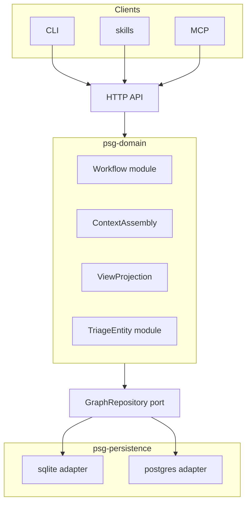

# Product State Graph — project seed

Product State Graph (PSG) is an agent-facing state graph for software products. It holds delivery state in SQL: what you build, in what order, what done means, current intent, and what you know. Agents are the primary users. They read and write through one HTTP API. The `psg` CLI, bundled skills, and MCP are API clients. PSG does not orchestrate external tools.

One PSG server hosts the graph for many products. A developer runs one server for all personal projects. A company runs one server for all company projects. Code repos hold a pointer to the server and a project code. They do not host the database.

This seed describes the product you rebuild in a new repository. The donor is [`packages/anneal`](https://github.com/zsoltcs1123/agentic-engineering/tree/main/packages/anneal) in the [agentic-engineering](https://github.com/zsoltcs1123/agentic-engineering) monorepo — implementation reference only. The Anneal name and metaphor are retired. Move code piece by piece with rigorous engineering. This document does not list migration steps. For a full keep/discard/maybe list of donor features, see [Donor feature inventory](donor-feature-inventory.md).

## Why this product exists

Delivery work spreads across many stores. Source code lives in git. Specs and decisions live in markdown files or a doc site. Research notes live in a wiki. Metrics live in SQL or SaaS. Customer docs live elsewhere.

None of those stores answer the questions an agent needs during delivery:

- What are you building right now?
- In what order should work land?
- What does done mean for this change?
- What durable facts should the next agent know?
- What is open, deferred, or broken?

PSG answers those questions with typed entities, dependency edges, workflow status, and document refs to external stores. Narrative stays in those stores. PSG indexes it.

PSG is not a wiki, a document store, or an issue tracker. It does not own committed vocabulary. An external glossary owns terms. PSG consumes them.

## What PSG connects to

PSG is store-agnostic. It does not assume a fixed delivery stack. In practice it links to external systems through refs and through tools that read both PSG and those systems.

| External system (example) | Typical store             | How PSG links                                                                                     |
| ------------------------- | ------------------------- | ------------------------------------------------------------------------------------------------- |
| Source code               | git                       | Changes drive implementation. A housekeep skill can catch drift between state and repo.           |
| Specs and decisions       | markdown in git, doc site | `DocumentRef` on projects and changes (`prd`, `architecture`, `adr`, and consumer-defined types). |
| Research                  | wiki, notes repo          | Out of PSG scope. Research may inform specs; PSG does not hold exploratory notes.                 |
| Metrics                   | SQL, SaaS                 | Out of PSG scope. Metrics may inform triage in external tools.                                    |
| Customer docs             | published site            | Out of PSG scope.                                                                                 |

PSG holds structured state and pointers. Deep read and edit of prose, code, and metrics stay in each system's native tool.

PSG does not grow orchestration mechanism: no run entity, no checker hooks, no ready queue, no `psg execute`. An external orchestrator may call the API, dispatch work, and write state back. That orchestrator is not part of PSG.

## Who uses PSG

Coding agents are the primary users. They work in parallel against the same server. Parallel agents need one API front door so writes serialize cleanly and conflicts surface as errors, not silent overwrites.

Humans use the same `psg` CLI. It is an API client, not an in-process shortcut to the database. PSG is not a universal UI for delivery work. Read specs where those files live. Edit code in the IDE. Query state with `psg context` and `psg view`.

## What PSG holds

Delivery state is a nested project tree. Every node is a `Project`. Child entities attach to a project. One workspace holds many root projects — one per product you track in that PSG instance.

```
Workspace (tenant: person or org)
└── Project (product A)
    ├── Project (sub-project)
    ├── Milestone
    ├── Change
    ├── Fact
    ├── Validation
    ├── Task
    ├── Bug
    └── Idea
└── Project (product B)
    └── …
```

Dependency edges (`link --depends-on`) are separate from traceability links (`change_id`, `bug_change`, `superseded_by`).

### Entity roles

**Project** — durable container with scope, boundaries, and optional capabilities. Status is `pending`, `in_progress`, or `obsolete`. Projects do not reach `done`. `obsolete` retires the product and keeps the tree.

**Milestone** — coarse ordering. Status flows `pending` → `in_progress` → `done`.

**Change** — substantial round of work with a clear deliverable. Small fixes and repo maintenance should not create changes. Carries a goal, deliverables, and optional document refs to external markdown. Status is `pending` → `in_progress` → `done`. Unfinished dependencies block the move to `in_progress`. Blocked is a read projection, not a stored status.

**Fact** — durable project memory: rationale, constraints, and non-obvious intentional behavior. Not an architecture decision record, not a task. Status is `active` or `superseded`. Facts may supersede earlier facts. A fact with no successor is deleted.

**Validation** — authored invariant with lifecycle and optional repo coverage claims. Outcomes live in the repo. Status is `active` or `superseded`, same machine as Fact.

**Task** — project-owned deferred work. Smaller than a Change. Default here when durability is unclear. Status is triage: `open`, `done`, `wontfix`, or `converted`. A task is usually absorbed by a Change through `change_id` and later marked `done`. It converts 1:1 only when the leftover grows into a Change or a Project.

**Bug** — broken behavior. Same triage statuses as Task. Usually absorbed by a Change through a change link, then `done`. Rarely converts 1:1.

**Idea** — future direction. Same triage statuses. Convert is the normal promotion: `converted_to_code` points at a Change or a Project.

**DocumentRef** — typed pointer to a document in an external store (`vision`, `architecture`, `adr`, and consumer-defined types). The donor dropped the first-class ADR entity. Decision prose stays in the external store; PSG holds the ref and status metadata.

### Vocabulary

PSG consumes committed vocabulary from elsewhere. It does not store definitions.

- Entity titles, goals, and deliverables use terms from the project's glossary.
- Fact entries may reference `concept:*` slugs (for example from a `GLOSSARY.md` in a docs repo).
- Do not introduce terms in PSG that are not in the glossary.
- When a term crystallizes, add it to the glossary first. Then use it in PSG and code.

A `concept:*` slug is a stable cross-system identifier. Display names may change. Slugs do not.

## Architecture

One domain. One HTTP API. Two database adapters. Every client uses the API.

```
CLI / skills / MCP  →  HTTP API  →  domain modules  →  GraphRepository port  →  sqlite adapter
                                                                              └──→  postgres adapter
```

The HTTP API is the contract. The CLI, skills, and MCP are thin clients. They do not open the database. Domain logic lives in the domain layer. API handlers validate, call domain functions, and serialize responses. Handlers stay thin — all business rules live in `psg-domain`, not in handlers or persistence.



### Domain modules

`psg-domain` is not a flat bag of structs. Group behaviour into deep modules — small interfaces, most logic inside.

**Workflow module** — owns the state machine end to end: transition tables, `transition(entity, new_status)`, dependency guards, milestone completion guards, and domain errors. The donor splits this across `domain/models.py` (tables only), `storage/guards.py`, `storage/transitions.py`, `commands/entities.py`, and `cli/_parse_fields.py`. Consolidate during the port. Persistence stores rows; it does not decide whether a transition is legal.

**TriageEntity module** — one module for Bug, Idea, and Task lifecycle: close, convert, link to change, resolve owner. The donor copies the same pattern three times (`commands/bug.py`, `commands/followup.py`, `commands/idea.py`). Parameterize by entity kind instead of porting three shallow modules.

**ContextAssembly** — builds the agent context bundle (active change, milestones, open triage, linked doc refs, recent history). The donor's `queries/context/` is deep but sits beside write orchestration with no package home. Lift it into domain. The API serializes the result to Pydantic DTOs; the CLI renders DTOs to text on the client side.

**ViewProjection** — overview, detail, filtered lists, dependency subgraphs, topological change ordering. Same split as context: domain assembles structured projections; API returns DTOs; CLI renderers stay in `psg-cli`.

Write orchestration (create, update, delete, move, recode) also lives in domain functions that call the persistence port. The donor's `commands/` package becomes domain write functions, not a parallel application layer beside queries.

### Persistence port

Do not thread `sqlite3.Connection` (or any driver handle) through domain or API code. The donor passes a raw connection through ~50 call sites across `storage/`, `db/`, `commands/`, and `queries/` — that implicit interface blocks the API from sitting in the middle.

Define a **GraphRepository** port in `psg-persistence` before building HTTP handlers:

- Entity CRUD with workspace scoping
- Graph operations (deps, traceability links, subtree)
- Search (keyword FTS behind the port; adapter-specific inside)
- Mutation log append and query
- Optimistic save with `expected_version` (see Concurrent agents)

Merge the donor's split persistence (`storage/` generic CRUD + `db/` sqlite-specific graph, codes, FTS, migrations) into one package behind this port. Extend the existing `RetrievalStore` protocol pattern to cover the full repository, not just search.

Two adapters justify the seam: sqlite (MVP) and postgres (V1). In-memory fake for domain and API tests. SQL stays inside adapters — nowhere else.

Bootstrap order: persistence port and sqlite adapter before HTTP API. Porting commands/queries onto a raw connection and adding API later recreates shallow pass-through handlers.

### Server and workspace

PSG runs as a server process (`psg serve` or a hosted deployment). You pick the database backend at deploy time:

| Backend | Typical use |
| --- | --- |
| **sqlite** | Single developer, low ops, one machine |
| **postgres** | Company deployment, many parallel agents, hosted SaaS |

Same schema and API on both backends. Adapter-specific code stays in persistence (full-text search, migrations, locking).

One **workspace** is a tenant boundary — a personal workspace or an org workspace. All projects for that tenant live in one database. `workspace_id` scopes every row. Nested projects stay rows inside the workspace; they are not separate databases.

This is a bigger shift than renaming Knowledge → Fact. The donor hosts one sqlite file per project under `~/.anneal/projects/{code}/`. PSG hosts one workspace database with many root projects. `psg init`, backup, migrate, and restore must target the workspace, not a per-repo database file. Cut workspace tenancy before porting entity CRUD.

**Workspace module** — a first-class concern in `psg-api` (auth + scoping), not an afterthought column:

- Bearer token validation and workspace membership lookup
- Row scoping: every repository call carries `workspace_id`
- Project registration (`psg init` registers a root project on the server)
- Audit: mutation log records `who` on each change

Auth is membership on the workspace, not entity ACLs. Even a solo developer uses a workspace and a token so the model does not fork when a second user joins.

### Repo linkage

A code repo stores a pointer file (for example `.psg/config.json`): server URL, workspace, project code, auth. `psg init` registers a project on the server and writes that pointer. State never lives inside the git repo.

### Concurrent agents

Multiple agents hit the same API concurrently. The server is the write choke point: transactions, dependency guards, and optimistic concurrency apply in one place. Clients retry or surface errors. Do not give agents a second path that opens sqlite or postgres directly.

**Optimistic concurrency** — wire `row_version` end to end. The donor auto-increments `row_version` via sqlite triggers but never checks it on update — parallel agents can silently overwrite each other.

- Every entity row carries `row_version`
- Domain `save(entity, expected_version)` checks before write; persistence adapter enforces in SQL
- API `PATCH` accepts `If-Match: <version>` (or equivalent body field); mismatch returns **409 Conflict**
- Document 409 in OpenAPI so agents know to re-read and retry
- Dependency guards run in the Workflow module at the same choke point, not scattered in storage SQL

## Scope tiers

### MVP

Core service in the new repository.

Ship:

- Domain models and the Workflow module (state machine, dependency guards, milestone guards — all in `psg-domain`)
- ContextAssembly and ViewProjection read modules in `psg-domain`
- TriageEntity module (Bug, Idea, Task — one module, not three copies)
- GraphRepository persistence port and the sqlite adapter (before HTTP API)
- Workspace module: bearer token auth, membership, row scoping (single-user is fine; model must not fork)
- The HTTP API (FastAPI) — thin handlers over domain functions
- Optimistic concurrency: `row_version` check on save, 409 on conflict
- The CLI as an API client: `psg context`, `psg view`, search, CRUD, recode, backup, migrate, and export
- CLI renderers (text output from API DTOs — not in-process domain or DB access)
- `psg serve`
- Agent skills (`/psg`, implement, plan, housekeep, init)
- Multi-project support inside one workspace
- `workspace_id` on all rows

Defer MCP to V1 if it blocks MVP. Do not ship a CLI path that bypasses the API.

MVP is also the layer cleanup pass. Donor code in `packages/anneal` works, but seams may be wrong. Split domain, persistence, API, and CLI client without changing behavior unless a constraint is wrong.

### V1

Production multi-user and agent tooling.

Add or harden:

- The postgres adapter
- Postgres as the recommended backend for org deployments
- Multi-user workspace membership (no SSO yet)
- MCP wrapping the HTTP API
- Hosted deployment story (you run the same API image; not a new schema)

V1 does not add entity ACLs or k8s orchestration requirements.

## Tech stack

| Area | Choice |
| --- | --- |
| Language | Python 3.14+ |
| Package manager | uv workspace |
| API | FastAPI |
| API wire models | Pydantic (request/response DTOs, OpenAPI) |
| Domain models | msgspec `Struct` (entities, invariants, domain logic) |
| CLI | Typer (`psg` command, HTTP API client) |
| MVP database | sqlite (WAL mode) |
| V1 database | postgres (same schema, deploy-time adapter swap) |
| Packaging | uv workspace packages in one repo (not published to PyPI) |

### Workspace packages

One repository. Four workspace packages. `import-linter` enforces dependency direction.

| Package | Holds | May depend on |
| --- | --- | --- |
| `psg-domain` | msgspec models; Workflow, TriageEntity, ContextAssembly, ViewProjection modules; write orchestration | stdlib, msgspec |
| `psg-persistence` | GraphRepository port; sqlite and postgres adapters; migrations; FTS (adapter-specific) | `psg-domain` |
| `psg-api` | FastAPI app; Pydantic DTOs; Workspace module (auth, scoping); thin handlers | `psg-domain`, `psg-persistence` |
| `psg-cli` | Typer commands; HTTP API client; text renderers; skills installer | API client only (no domain, no persistence) |

Domain and API wire models stay separate. Handlers map Pydantic DTOs to domain structs and back. Do not use Pydantic in `psg-domain`. Do not use msgspec as the FastAPI response model type.

The OpenAPI schema from FastAPI is the contract for CLI, MCP, and external clients.

Keep dependencies minimal. Justify each new package beyond these four.

### Testing

Tests sit at the outer edge of the architecture, same as the HTTP API and CLI. They exercise the system through intended boundaries, not through internal wiring.

- **Domain** — pure unit tests against domain functions and the state machine. No HTTP, no database, no FastAPI.
- **API** — contract tests through HTTP against a running app or test client. Assert OpenAPI-shaped request/response behavior; do not re-test domain rules already covered below.
- **Persistence** — integration tests through the adapter (in-memory sqlite is enough for most cases). Postgres-specific behavior gets its own integration suite when the adapter lands.

Fragile tests that reach past a boundary into another package's internals are a design smell. Fix the seam, do not patch the test.

## Data design notes

PSG stays a SQL state graph. Typed entities, domain-owned state machine. Not a wiki, not git markdown as source of truth, not an issue tracker.

The entity tree above is the locked taxonomy. Use **Fact** and **Task**, not donor names Knowledge and Followup. Do not restore the ADR entity.

Rows carry `workspace_id`. Membership tables link users to workspaces. The mutation log carries `who` for audit.

Sqlite and Postgres diverge on full-text search and migration tooling. Plan adapter-specific index code. Keep migrations versioned and runnable on both backends where possible.

Document refs stay opaque strings. PSG lists type and ref in `psg context`. It does not fetch or render external markdown.

## How you rebuild it

Create a new repository for Product State Graph. Treat `packages/anneal` as the donor.

1. **Cut dead seams first.** Delete donor paths marked discard before lifting anything: vector search stub (`queries/search/vector.py`), `upload` CLI, `view-set`, `Change.sequence`, `embedding_id` columns, leftover `adr/markdown.py` (ADR entity removed in ADR-009). Do not port then delete — dead code widens the persistence interface for no gain.
2. **Domain first.** Lift `domain/models.py`, consolidate the Workflow module (pull guards out of `storage/` and `commands/`), collapse triage into TriageEntity, lift ContextAssembly and ViewProjection from `queries/`.
3. **Persistence port second.** Merge `storage/` + `db/` behind GraphRepository. Sqlite adapter only at first. No raw connection outside adapters.
4. **Workspace third.** Schema with `workspace_id` on all rows, membership tables, auth middleware. Bigger than entity rename — do not retrofit after CRUD lands.
5. **API fourth.** Thin FastAPI handlers, Pydantic DTOs, optimistic concurrency (409), workspace scoping on every route.
6. **CLI client fifth.** Replace `cli/_workspace.py` sqlite access with HTTP calls. Keep text renderers client-side.
7. **Skills last.** Bundle after CLI proves the API contract.

Fix a layer when the seam is wrong. If the CLI imports sqlite directly, replace it with API calls.

Keep behavior unless a locked decision says otherwise. Locked: state graph role, Fact and Task taxonomy, no ADR entity, Fact and Validation `active`/`superseded` only (no `obsolete` on that enum), `wontfix` kept, blocked as a read projection not a status, convert as 1:1 promotion vs `change_id` absorption, API-only client path, FastAPI, msgspec domain + Pydantic wire models, four workspace packages, thin API handlers with all business rules in domain, GraphRepository persistence port, domain-owned state machine, workspace tenancy from MVP.

Run the canonical gate (`prek run --all-files`) before you merge each piece. That gate is the minimum quality loop: formatting, lint, types, tests, and module boundaries. Add a complexity-plus-coverage gate for agent-written code (CRAP or an equivalent) so cleanliness is mechanical, not review-by-diff.

A blank-page rewrite is a risk. The donor has working CLI commands, migrations, and tests. Move and harden beats rewrite from memory. ~70% of donor integration tests assume in-process sqlite — rewrite as domain unit tests, API contract tests, and thin CLI e2e against `psg serve`.

## What we keep and discard from the donor

See [Donor feature inventory](donor-feature-inventory.md) for the full list with maybe items.

**Keep:** entity system (rename Knowledge → Fact, Followup → Task), ChangeKind, dependency graph, traceability links, milestones, document refs, hierarchical codes and recode, `context` / `view` / `search` / `log`, CRUD commands, state machine and transition guards, FTS search, mutation log, bundled skills (`/psg`, implement, plan, init), sqlite and postgres adapters.

**Discard:** change `sequence`, milestone composition, `upload`, `view-set`, vector search stub and `embedding_id` columns, leftover `adr/markdown.py`, legacy migration hooks, `OPERATING-CONTRACT.md`, donor naming (`anneal` → `psg`), per-repo database hosting, CLI in-process domain access, raw `sqlite3.Connection` as the persistence interface, `obsolete` on Fact and Validation. Do not resurrect removed donor entities (ADR, ValidationRun, deliverable entity, and so on). Cut these in the first PR of the new repo — see How you rebuild it step 1.

**Defer:** MCP (V1 if not MVP), multi-user membership polish (V1).

## Risks and open questions

**Sqlite and Postgres parity.** Full-text search, migrations, and locking differ. Adapter-specific code stays inside persistence adapters behind GraphRepository — not scattered through domain. Test both paths for any query agents rely on. Parallel agents on sqlite hit write throughput limits sooner than postgres. The postgres adapter is greenfield in V1; the donor has sqlite only. Schema and behaviour are the reference, not a second implementation to port.

**Workspace hosting flip.** Per-project database files → one workspace database is deeper than Fact/Task rename. Backup, migrate, init, and multi-project queries all change. Cut workspace tenancy before entity CRUD.

**State machine locality.** If transition rules stay split across storage, commands, and CLI parsing (as in the donor), every new entity kind multiplies the leak. Consolidate in the Workflow module during domain port.

**API handler bloat.** Violates a locked decision. If handlers encode business rules, the dependency graph lies about where policy lives and agents lose one source of truth.

**Rewrite temptation.** A new repo feels like permission to redesign everything. Resist unless a locked decision requires it. Move working code, then delete dead paths.

**Sqlite async.** FastAPI is async; sqlite access may use `aiosqlite` or a sync domain behind a thread pool. Pick one pattern at bootstrap and keep it consistent.

**Identity.** Bearer tokens and workspace membership from MVP. No SSO, no OAuth provider matrix, no per-entity permissions at first. Revisit when a real multi-tenant deployment needs more.

**Hosted Postgres provider.** Compose on a VM is enough for early org deploys. STACKIT and Supabase are later plug options. The postgres adapter should not hardcode one host.

## What this is not

| Tool                  | Why it is different                                                                        |
| --------------------- | ------------------------------------------------------------------------------------------ |
| Linear, Jira          | Org-scale issue tracking. PSG **Task** is project-scoped deferred work, not a replacement. |
| Notion, Obsidian      | Document stores. PSG holds structured state, not prose bodies.                             |
| Markdown files in git | Shared files give docs but not a queryable graph, deps, or workflow status.                |
| An orchestrator       | Run tracking, checkers, cadence, land path. May consume PSG; does not live inside it.      |

The donor `packages/anneal` is the starting implementation. Rename the CLI to `psg`, Knowledge to Fact, and Followup to Task in the rebuild. Do not inherit package layout if seams are wrong.

## Success criteria

Rebuild succeeded when:

- An agent runs `psg context` against a running server and gets the same class of answers as the donor.
- One PSG instance holds multiple products in one workspace.
- Parallel agents read and write through the API without a second database path; concurrent writes surface 409 conflicts, not silent overwrites.
- MVP ships with `psg serve`, FastAPI, sqlite, GraphRepository port, and workspace auth — no CLI bypass of the API.
- Workflow rules, context assembly, and view projection live in `psg-domain`; handlers and CLI do not duplicate them.
- No narrative prose moved into PSG tables. Document refs still point at external stores.
- External orchestrators consume PSG through the API and MCP, without new PSG entities for runs or queues.

## One line

Product State Graph is the SQL state graph for delivery: one server, many products, typed entities, deps, workflow status, and refs to external docs. Agents query and update it through the API.
